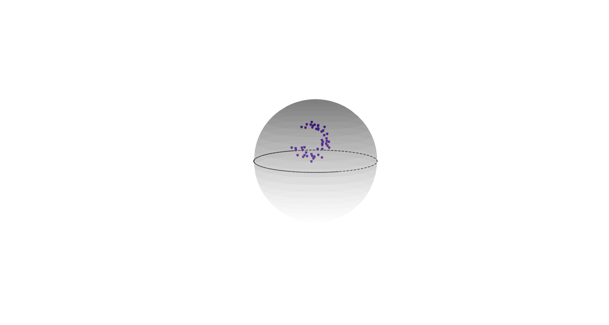
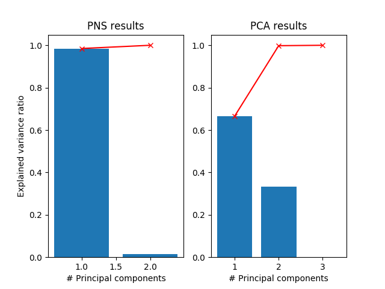

pyPNS
===

## Table of Contents

[TOC]

## Overview

This is python implementation of Principal Nested Spheres (PNS). 
Please refer to the following paper for technical and application details.
> Jung et al., Analysis of principal nested spheres.
> Kim et al., Small‐sphere distributions for directional data with application to medical imaging.

Toy example
---

The following figure shows the simulated data (shown as blue points) that distribute along a small circle on $\mathbb{S}^2$. A user can access the simulated data from `toy_example_small_circle.mat`.

Fitting with a PNS model to the data leads to more useful variation directions. As a result, the majority (~98%) of the variation can be captured in the first principal component; see the left on the following figure. As a comparison, Principal Component Analysis (PCA) needs more components.

The bars are the percentage of the explained variance by each principal component. The red curve is the cumulative explained variance.

Project
---
`pns_test.py`: This is the demo application of PNS. A user may refer the code for the usage of the PNS fitting.
`principal_nested_spheres.py`: This is the major module that implements interfaces of fitting PNS to data.
`utils.py`: This file provides some handy functions for operations on hyperspheres.
`toy_example_small_circle.mat`: This is the toy example data used in the `pns_test.py`.

## Appendix and FAQ

:::info
**Find this document incomplete?** Leave a comment!
:::

###### tags: `Non-Euclidean statistics` `Euclideanization`
